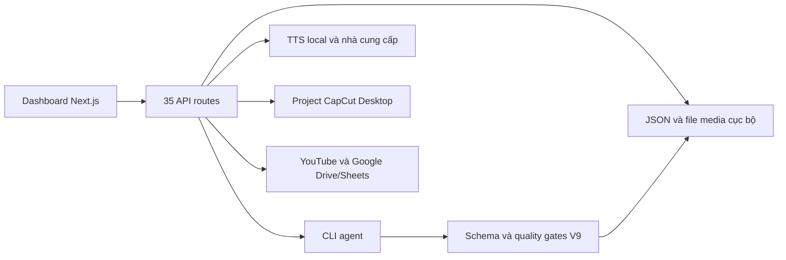

**Báo cáo đánh giá tổng thể ai_auto_video — 08/09/2026, UTC+7**

Dự án có nền tảng chức năng khá rộng và bộ quy tắc sản xuất nội dung được đầu tư rõ ràng. Bản ứng dụng chính build được, TypeScript kiểm tra đạt và 37 unit test JavaScript đều đạt. Tuy vậy, hiện chưa đủ cơ sở coi hệ thống là một nền tảng production an toàn, bền dữ liệu và tự vận hành đáng tin cậy: đã xác nhận lỗi đọc/ghi/xóa file ngoài phạm vi video, đầu vào đi vào lệnh shell, mất cập nhật lịch sử khi upload, xuất thiếu cảnh nhưng báo thành công và sai lệch giữa QA V9 với phần triển khai web.

Mức phù hợp hiện tại: công cụ cá nhân có người giám sát trên một máy Windows đáng tin cậy. Cần xử lý các phát hiện P0/P1 trước khi mở cho thiết bị khác hoặc vận hành nhiều tác vụ đồng thời. Kết luận này dựa trên mã nguồn và kiểm chứng dưới đây, không phải điểm số cảm tính về chất lượng video.

**Phạm vi và cách kiểm tra.** Đã rà soát cấu trúc repo, 35 Route Handler của ứng dụng chính, luồng giao diện, thư viện lưu trữ/bảo mật/CapCut/YouTube, tài liệu runtime V9, schema, công cụ QA và các dịch vụ TTS phụ trợ. Đã chạy build, kiểm tra TypeScript, Jest, lint có giới hạn vào `app` và `__tests__`, hồi quy Python, kiểm tra dependency và HTTP của bản production. Những lỗi có tác động ghi/xóa hoặc gọi dịch vụ được tái hiện bằng file đánh dấu trong `scratch/audit_20260908`, hoặc bằng mock bộ nhớ. Không chạy worker tạo video, không xử lý giọng nói bằng dịch vụ trả phí và không upload YouTube thật.

Tại thời điểm đánh giá, `queue.json` và `database/history.json` đều là mảng rỗng; không có project trong hai thư mục video. Vì vậy chưa thể chấm độ hay của kịch bản, độ đúng giáo lý/lịch sử, chất lượng giọng, tính liên tục hình ảnh, độ khớp tiếng-hình hoặc chất lượng video xuất cuối. Schema queue/history mô tả từng phần tử, nên mảng rỗng không được diễn giải là dữ liệu sản phẩm sai schema.

Công cụ Browser không khởi tạo được vì lỗi sandbox `apply deny-read ACLs`; chưa thực hiện kiểm tra ảnh chụp, tương tác, responsive hoặc accessibility trên trình duyệt. Kiểm tra HTTP/HTML thành công không thay thế những kiểm tra đó. Các ứng dụng phụ được đọc mã và kiểm tra cú pháp Python; chưa build/chạy độc lập toàn bộ ứng dụng phụ, tải model GPU hay điều khiển CapCut Desktop.

**Kết quả kiểm tra đo được**

| Hạng mục | Kết quả | Diễn giải |
|---|---|---|
| `npm test -- --runInBand` | 37/37 đạt, 3/3 suite | Tập trung vào security/storage/CapCut utilities; không chứng minh toàn bộ API an toàn |
| `npx tsc --noEmit --incremental false` | Đạt | Mã TypeScript trong phạm vi tsconfig biên dịch hợp lệ |
| `npm run build` | Đạt | Compile khoảng 55 giây, bước TypeScript khoảng 55 giây; có cảnh báo trace phạm vi quá rộng |
| `npx eslint app __tests__ ...` | 223 lỗi, 87 cảnh báo trên 66 file | 211 lỗi `no-explicit-any`; ngoài ra có lỗi React hooks, refs và prefer-const |
| `.agents/tools/run_regression_suite.py` | 67 đạt, 10 thất bại; 4/8 file kiểm thử đạt hoàn toàn | Sau khi cung cấp pytest trong scratch và bật UTF-8 |
| Python có sẵn | Cả Python hệ thống và `.venv` thiếu pytest | Chưa có manifest dependency Python được tìm thấy trong phần mã dự án đã quét |
| Cú pháp Python | 44 file đạt | 30 tool, 8 test, 2 script OmniVoice, 4 script TTS; chỉ parse AST, không chứng minh đủ runtime dependency |
| `npm audit --json` | 8 gói: 7 high, 1 moderate | Là cảnh báo dependency, chưa tương đương 8 đường khai thác trong ứng dụng |
| HTTP production localhost | 7 yêu cầu có kết quả phù hợp | Trang chủ/queue/history/scan: 200; content/audio thiếu tham số: 400; GET endpoint chỉ có POST: 405 |
| Dữ liệu video thực tế | 0 project, 0 mục lịch sử, 0 task | Chưa có dữ liệu để chạy QA sản phẩm cuối |
| Git | Chưa có HEAD/commit; mã dự án đang untracked | Chưa có mốc rollback trong Git tại workspace này |

Python runner mặc định còn gặp lỗi giải mã cp1252 trên Windows. Đã chạy lại với `PYTHONUTF8=1` để lấy kết quả nghiệp vụ, không sửa code runner. Lượt audit bổ sung `--omit=dev` bị auto-review từ chối do hạn mức sử dụng công cụ, nên báo cáo không tự suy ra số cảnh báo chỉ thuộc production.

**Kiến trúc hiện tại và những điểm nên giữ**

Thiết kế file JSON dễ kiểm tra thủ công, phù hợp workflow trên máy cá nhân. Phần CapCut đã tách materials, segments và draft builder. Có atomic rename trong tiện ích storage, cache mtime/ETag ở một số API, timeout ở một số lời gọi, tải trễ YouTubePanel và hệ thống toast. Đây là những nền tảng có ích, nên gia cố thay vì viết lại toàn bộ.

Phần V9 có ưu điểm rõ: scene splitting bằng công cụ xác định, visual bible làm nguồn nhất quán, kiểm tra nguồn chứng cứ, phân biệt QA xác định với semantic QA, micro-batch có checkpoint và receipt gắn hash, không mặc định coi AI lỗi là PASS. 32 kiểm thử quality gates và các nhóm core/editorial/V8 hiện đều đạt. Điểm yếu lớn là điều phối web, quản lý vòng đời job và lưu trữ chưa bảo đảm các quy tắc đó ở cấp hệ thống.

Thang ưu tiên của báo cáo: P0 cần xử lý ngay trước khi mở truy cập từ máy khác; P1 ảnh hưởng mất dữ liệu, tính đầy đủ hoặc độ tin cậy pipeline; P2 ảnh hưởng trải nghiệm, bảo trì và khả năng kiểm chứng. Những mục chỉ đọc mã hoặc cần điều kiện khai thác được ghi rõ.

**F01 — P0: API âm thanh cho phép đọc, ghi và xóa file ngoài thư mục video. Đã tái hiện.**

Vị trí: [security.ts](D:/ai_auto_video/app/lib/security.ts:14), [audio-file/route.ts](D:/ai_auto_video/app/api/audio-file/route.ts:22), cùng nhánh DELETE tại dòng 115 và POST tại dòng 160.

`sanitizePath` cho phép toàn bộ workspace và thư mục home, nhưng được dùng để bảo vệ API vốn chỉ nên thao tác file âm thanh của một project. API cũng không khóa `filename` theo tên file và phần mở rộng âm thanh. Đường dẫn chứa `..` có thể thoát `data/video_short` nhưng vẫn vượt qua kiểm tra vì còn nằm trong workspace.

Kiểm chứng: một file `.txt` vô hại trong scratch được GET đọc thành công, POST ghi lại thành công và DELETE xóa thành công; cả ba đều trả 200. Không đọc hay sửa file bí mật trong kiểm chứng. Hậu quả có thể gồm lộ cấu hình, sửa mã nguồn hoặc mất dữ liệu dưới quyền của tiến trình web.

Khắc phục: resolver riêng cho project và audio; xác thực `type`, slug, basename và extension; kiểm tra containment dưới đúng project sau khi xử lý realpath/junction; tách quyền browse khỏi quyền đọc/ghi/xóa. Bổ sung kiểm thử cấp route cho traversal, đường dẫn ngoài project và file không phải audio.

**F02 — P0: Ghép trực tiếp đầu vào vào lệnh hệ thống ở API mở thư mục. Đã xác nhận đường truyền dữ liệu bằng mock.**

Vị trí: [open-folder/route.ts](D:/ai_auto_video/app/api/open-folder/route.ts:37).

`folder` từ request được nối vào `exec` dưới dạng chuỗi. Dấu nháy và ký tự điều khiển shell trong đầu vào có thể thoát khỏi phần đường dẫn. Kiểm chứng chỉ bắt chuỗi lệnh đưa tới `exec`, không chạy shell, cho thấy phần `& echo AUDIT_MARKER` đã nằm ngoài dấu nháy.

Khắc phục: kiểm tra đường dẫn tồn tại và thuộc phạm vi được phép; dùng gọi executable với mảng đối số, không qua shell. Rà soát cùng kiểu ghép chuỗi ở open-audio, thumbnail và các route gọi CLI. Mỗi route cần xác minh riêng, không mặc định mọi chỗ dùng exec đều khai thác giống nhau.

**F03 — P0 khi mở mạng: Chưa có lớp xác thực người gọi cho API điều khiển máy/tài khoản. Đọc mã và HTTP.**

Vị trí: [package.json](D:/ai_auto_video/package.json:6), [queue API](D:/ai_auto_video/app/api/queue/route.ts:40), [upload API](D:/ai_auto_video/app/api/youtube/upload/route.ts:9), [history DELETE](D:/ai_auto_video/app/api/history/route.ts:290).

Lệnh dev lắng nghe `0.0.0.0`. Các handler có thể gọi CLI, thay đổi file, xóa project và upload bằng tài khoản server nhưng không yêu cầu session/secret của người gọi. OAuth Google hiện phục vụ tài khoản Google của server, không phải lớp xác thực người sử dụng dashboard. Không tìm thấy middleware/proxy kiểm soát truy cập áp dụng cho nhóm API này.

Khắc phục: mặc định bind loopback cho công cụ một người dùng; nếu cần LAN, thêm xác thực, kiểm soát Origin/CSRF cho thao tác thay đổi trạng thái và giới hạn các chức năng đặc quyền. Mức phơi lộ thực tế còn phụ thuộc firewall/router; chưa thử truy cập từ thiết bị khác và không kết luận máy đang bị tấn công.

**F04 — P1: File chứa token/key chưa được Git ignore và xuất hiện trong manifest trace build. Đã kiểm tra sự hiện diện.**

Vị trí: [.gitignore](D:/ai_auto_video/.gitignore:48), [build-traces.json](D:/ai_auto_video/scratch/audit_20260908/build-traces.json).

`config/token.json` có trường access_token/refresh_token không rỗng; `config/youtube_aip_key.json` có key không rỗng. Cả hai không được ignore. Không in giá trị bí mật. Repo chưa có commit, nên đây là nguy cơ đưa vào lần commit đầu tiên, chưa có bằng chứng đã push ra ngoài.

Build cảnh báo trace toàn project; 21 manifest route có tham chiếu đến hai file trên. Đây là nguy cơ đi theo artefact khi đóng gói/triển khai, không phải bằng chứng chúng đã được đưa vào JavaScript public hoặc đã lộ trên Internet.

Khắc phục: lưu secrets ngoài mã/artefact, dùng cấu hình runtime phù hợp, bổ sung ignore và kiểm tra manifest output. Khi có bằng chứng chia sẻ artefact/token, thay token liên quan; chưa tự thu hồi hay thay credential trong đợt đánh giá này.

**F05 — P1: Upload YouTube ghi đè mất thay đổi lịch sử xảy ra trong thời gian upload. Đã tái hiện bằng mock.**

Vị trí: [upload/route.ts](D:/ai_auto_video/app/api/youtube/upload/route.ts:24), đoạn gọi upload tại dòng 131 và ghi file tại dòng 176.

Handler đọc toàn bộ history trước thao tác upload dài, rồi ghi lại snapshot cũ khi upload xong. Nếu worker vừa thêm video khác hoặc một request khác sửa lịch sử trong khoảng đó, thay đổi mới bị mất.

Kiểm chứng: mock thêm mục B trong lúc upload mục A đang chờ; sau upload, history chỉ còn A. Không gọi YouTube thật.

Khắc phục: transaction hoặc khóa liên tiến trình; khi hoàn tất chỉ cập nhật bản ghi đích trên trạng thái mới nhất. Chuyển dữ liệu vận hành sang kho có transaction là hướng phù hợp khi cần nhiều worker. Atomic rename chỉ bảo vệ lần ghi, không giải quyết lost update.

**F06 — P1: Upload không chống thực hiện lặp lại. Đã tái hiện bằng mock.**

Vị trí: [upload/route.ts](D:/ai_auto_video/app/api/youtube/upload/route.ts:26).

Request tiếp theo với cùng historyId vẫn đi vào upload dù bản ghi đã có youtube_video_id/trạng thái published. Kiểm chứng gọi hai lần cho cùng video dẫn tới hai lần gọi hàm upload giả và đều trả 200. Khi người dùng thử lại sau timeout, có thể tạo hai video thật.

Khắc phục: idempotency key gắn project và bản video xuất; trạng thái uploading có claim nguyên tử; ghi nhận videoId ngay khi dịch vụ trả về; quy trình khôi phục khi response bị mất. Việc chủ động upload lại cần một thao tác riêng có chủ đích.

**F07 — P1: Hàm đọc JSON có thể thay đổi nội dung chuỗi hợp lệ. Đã tái hiện.**

Vị trí: [storage.ts](D:/ai_auto_video/app/lib/storage.ts:36).

Regex sửa trailing comma chạy trên toàn văn JSON, kể cả trong string. Chuỗi `Narration with comma,} and comma,]` bị đọc thành `Narration with comma} and comma]`. Tác động có thể đến lời thoại/prompt/văn bản cấu hình.

Ngoài ra, lỗi parse trả fallback như `[]`; nếu phía gọi tiếp tục ghi, dữ liệu lỗi có thể bị ghi đè thành bộ dữ liệu mới nhỏ hơn. Khả năng này đọc được từ mã, chưa gây lỗi lên file vận hành.

Khắc phục: parse JSON chuẩn; nếu hỗ trợ repair thì chỉ thực hiện ở bước nhập dữ liệu có báo lỗi/backup, không sửa ngầm ở tầng đọc dùng chung. Đường ghi phải dừng khi nguồn dữ liệu đang lỗi. Không quảng bá atomic write là chống mọi race condition.

**F08 — P1: Hàng đợi chưa xác thực schema tại API và chưa quản lý worker bền vững. Có kiểm chứng đầu vào.**

Vị trí: [queue/route.ts](D:/ai_auto_video/app/api/queue/route.ts:47), dòng 135, 147–168; [ProcessQueue](D:/ai_auto_video/.agents/skills/ProcessQueue/SKILL.md:27).

API chỉ kiểm tra trường không rỗng. Request có các giá trị enum `INVALID` vẫn trả 201 và được lưu trong hàng đợi giả của kiểm chứng. aiModel không bắt buộc tại API dù schema yêu cầu; category từ request không được chuyển vào task. PUT cho phép ghi status/workerId/lockedAt mà không kiểm tra chuyển trạng thái hay quyền sở hữu job.

Mỗi POST khởi chạy một cửa sổ CLI nhưng không theo dõi PID/exit để phản ánh lỗi khởi động, không có claim/lease/heartbeat/cancel nguyên tử. `lockedAt` và `workerId` là trường dữ liệu, chưa đủ tạo khóa thực thi. Tài liệu còn dùng nhiều tên runtime chung như `_claim_evidence.json`, `_editorial_message_lock.json`; nhiều worker có nguy cơ ghi đè nhau. Chưa chạy song song worker thật để đo tác động.

Khắc phục: validate payload server-side theo hợp đồng; claim job trước khi spawn; theo dõi process/timeout/retry; khóa toàn pipeline hoặc namespace runtime theo task. Có thể giữ 11 bước canonical, chỉ gia cố lớp điều phối bao quanh. Nếu chưa làm concurrency an toàn, giới hạn một worker chủ động.

**F09 — P2: Dashboard chưa cung cấp theo dõi hàng đợi đầy đủ; polling bỏ qua pending. Đọc mã.**

Vị trí: [QueueSidebar.tsx](D:/ai_auto_video/app/components/QueueSidebar.tsx:3), [useQueue.ts](D:/ai_auto_video/app/hooks/useQueue.ts:37), [page.tsx](D:/ai_auto_video/app/page.tsx:34).

QueueSidebar trả null. Trang chính lấy queue và handler xóa nhưng không render phần tiến độ hàng đợi. Polling chỉ bật với processing/visual_sessions_pending; task mới thường còn pending khi lần fetch sau submit kết thúc nên có thể không được poll tiếp. Một lần timeout/error trả `[]` còn có thể dừng polling.

Khắc phục: hiển thị task, bước hiện tại, lỗi, thời điểm cập nhật và trạng thái worker; coi pending là trạng thái cần theo dõi; phân biệt lỗi mạng với hàng đợi rỗng; reconnect/retry có kiểm soát. Cần kiểm tra tương tác trên browser sau khi công cụ khả dụng.

**F10 — P1: Gộp Veo bỏ qua chapter JSON lỗi nhưng vẫn xuất file và báo thành công. Đã tái hiện.**

Vị trí: [merge-veo-prompts/route.ts](D:/ai_auto_video/app/api/merge-veo-prompts/route.ts:66).

Với hai chapter, một hợp lệ chứa một scene và một hỏng JSON, API trả 200/success, thông báo “1 scene từ 2 chapter”, đồng thời xuất gói thiếu chapter. Đây là nguy cơ thiếu cảnh âm thầm ở công đoạn render.

Khắc phục: dừng khi bất kỳ chapter nào lỗi; validate từng scene, đủ trường, thứ tự và không trùng/mất số cảnh; chỉ thay gói export sau khi toàn bộ kiểm tra đạt. Ghi tạm rồi rename để không mất bản export trước nếu thất bại.

**F11 — P1: Timeline ước lượng được trình bày như đồng bộ chính xác. Đã tái hiện luồng API bằng mock.**

Vị trí: [align-timeline/route.ts](D:/ai_auto_video/app/api/align-timeline/route.ts:23), dòng 60 và 89; [audio_timeline_aligner.py](D:/ai_auto_video/.agents/tools/audio_timeline_aligner.py:305).

Công cụ Python mặc định từ chối khi Whisper không có timestamp từ; chỉ chia theo tỷ lệ số từ khi có cờ fallback. API lại mặc định `allow_fallback=true`. Khi stdout nói rõ timeline là ước lượng, API vẫn trả thông báo “Đã đồng bộ timeline chính xác”. UI gửi request không chọn fallback và hiện thông báo này.

Khắc phục: mặc định false; khi không đạt thì giải thích thiếu dữ liệu nhận dạng. Nếu người dùng chọn ước lượng, trả phương pháp/confidence trong kết quả runtime/API và ghi rõ trạng thái ước lượng trên UI. Không thêm field trái schema vào metadata/chapter canonical.

**F12 — P1: Gate editorial sau khi cleanup không chứng minh script còn nguyên bản đã được duyệt. Đã tái hiện gate riêng.**

Vị trí: [qa_automation.py](D:/ai_auto_video/.agents/tools/qa_automation.py:1356).

Khi cả lock và receipt đều không còn, chỉ cần history có cùng folder là gate editorial trả True để cho phép visual-only regeneration. Không có hash script lưu bền để kiểm tra điều kiện “chỉ thay hình”. Kiểm chứng bằng project giả có script đã thay và history cùng tên: gate riêng vẫn trả True.

Đây là lỗ hổng của gate editorial sau hoàn thành, không phải chứng minh toàn bộ QA có thể bỏ qua mọi lỗi. Việc chỉ so folder mà không kèm loại video cũng làm định danh chưa đủ chặt.

Khắc phục: giữ bằng chứng hoàn thành gắn hash trong kho audit riêng ngoài canonical metadata; chỉ miễn kiểm tra lại khi script hash khớp bản đã duyệt và loại job thực sự chỉ thay hình. Script đổi phải có lượt editorial mới.

**F13 — P1: Hồi quy và manifest phát hành chưa đồng bộ với chuyển đổi nội dung. Đã chạy kiểm thử.**

Vị trí: [test_contract_integrity.py](D:/ai_auto_video/.agents/tests/test_contract_integrity.py), [test_v9_hardening.py](D:/ai_auto_video/.agents/tests/test_v9_hardening.py:35), [RELEASE_MANIFEST_V9.json](D:/ai_auto_video/.agents/RELEASE_MANIFEST_V9.json:8).

10 lỗi gồm: 1 kiểm thử manifest hash không khớp ba schema history/queue/topic_research; 3 SEO test và 4 Veo-regeneration test dùng `en` trong khi CLI hiện chỉ nhận `vi` hoặc bảng word-count không còn `en`; 2 test dịch chủ đề Trái Đất không còn đạt điều kiện concept/duplicate của bộ kiểm thử cũ.

Không nên diễn giải thành “mọi nội dung Phật giáo tiếng Việt đều hỏng”. Đây là bằng chứng chuyển đổi phạm vi chưa được cập nhật đồng bộ, đồng thời cam kết tương thích lịch sử/cross-language cần được quyết định rõ. Trường hợp duplicate AI không chạy trả WARNING/MANUAL_REVIEW, không báo PASS giả.

Khắc phục: thống nhất hỗ trợ dữ liệu cũ và phạm vi sinh mới; cập nhật fixtures VI/Phật giáo mà vẫn kiểm tra đúng hành vi; giữ test tương thích thực sự nếu hợp đồng còn yêu cầu; tạo hash manifest từ file khi đóng gói; không chỉ đổi expected để làm xanh test.

**F14 — P2: Cache scan có thể trả 304 theo dữ liệu cũ sau khi TTL hết; scan root cấu hình bị bỏ qua. Đã tái hiện phần 304.**

Vị trí: [scan-folders/route.ts](D:/ai_auto_video/app/api/scan-folders/route.ts:84), dòng 89 và 130.

Sau khi cache hết hạn, handler so If-None-Match với ETag cũ và trả 304 trước khi đọc lại filesystem. Kiểm chứng tua đồng hồ giả 20 giây: lần hai trả 304, không gọi lại readdir. Ngoài ra ETag chỉ theo mtime hai thư mục cha, không phản ánh chắc chắn file MP4/metadata thay đổi trong project con. `VUTRU_SCAN_ROOT` dùng làm cache key, nhưng việc quét vẫn cố định dưới cwd/data.

Khắc phục: hết TTL phải tính lại dữ liệu/fingerprint trước khi trả 304; fingerprint bao gồm thành phần thật sự ảnh hưởng kết quả; thực thi scan root cấu hình hoặc bỏ cấu hình đã không còn hỗ trợ. Content/history ETag cũng cần đối chiếu đầy đủ dependency ngoài thư mục, ví dụ trạng thái CapCut nằm bên ngoài data.

**F15 — P1 nếu dùng OAuth: Thiếu state để ràng buộc lượt đăng nhập Google với phiên khởi tạo. Đọc mã.**

Vị trí: [youtube/auth](D:/ai_auto_video/app/api/youtube/auth/route.ts:5), [youtube/callback](D:/ai_auto_video/app/api/youtube/callback/route.ts:8), [google-auth](D:/ai_auto_video/app/api/google-auth/route.ts:23), [google-auth/callback](D:/ai_auto_video/app/api/google-auth/callback/route.ts:8).

Luồng tạo URL không sinh state; callback nhận code và lưu token mà không đối chiếu state/session. Có nguy cơ gắn nhầm tài khoản hoặc login CSRF trong mô hình phù hợp. Chưa thực hiện tấn công OAuth hoặc đổi tài khoản đang kết nối.

Khắc phục: state ngẫu nhiên dùng một lần, gắn phiên và hạn dùng; kiểm tra trước đổi code; xử lý cancel/error rõ; chuẩn hóa redirect URI thay vì hard-code localhost:3000 cho một phần luồng. Google mô tả state như cơ chế bảo vệ CSRF trong [hướng dẫn OAuth web server](https://developers.google.com/identity/protocols/oauth2/web-server#creatingclient).

**F16 — P2: Chất lượng code và phạm vi test chưa theo kịp độ lớn giao diện. Đã chạy lint và đọc mã.**

Vị trí: [ContentViewer.tsx](D:/ai_auto_video/app/components/ContentViewer.tsx), [YouTubePanel.tsx](D:/ai_auto_video/app/components/YouTubePanel.tsx), [types.ts](D:/ai_auto_video/app/types.ts), [eslint-app.json](D:/ai_auto_video/scratch/audit_20260908/eslint-app.json).

ContentViewer 2.839 dòng, YouTubePanel 1.611 dòng, AudioEditorModal 918 dòng; giao diện chứa nhiều logic mạng, TTS, file và trạng thái. 211 lần `any` bị lint bắt làm giảm giá trị của strict TypeScript ở đúng ranh giới dữ liệu. Scene type chưa diễn tả đầy đủ trường canonical. Ba suite Jest hiện không có test cấp route hay giao diện; dependency React testing đã cài nhưng chưa thấy suite UI.

Một số thao tác xóa trong ContentViewer không kiểm tra `res.ok`; nút làm mới báo thành công trước khi tất cả fetch hoàn tất. loadContent chưa có cơ chế loại response cũ khi chuyển project nhanh. Đây là rủi ro đọc từ mã, chưa tái hiện tương tác trình duyệt.

Khắc phục: tách ContentViewer theo project selector, audio, prompt, SEO và actions; dùng hook/service có kiểu dữ liệu rõ; normalize API errors; thêm test tích hợp cho luồng có hậu quả, ưu tiên các lỗi đã tái hiện. Không cần viết test chỉ sao chép từng dòng implementation.

**F17 — P2: Tài liệu, khả năng tái tạo môi trường và quản lý phiên bản chưa hoàn chỉnh. Đã kiểm tra file.**

Vị trí: [README.md](D:/ai_auto_video/README.md:1), [queue prompt](D:/ai_auto_video/app/api/queue/route.ts:79), [run_regression_suite.py](D:/ai_auto_video/.agents/tools/run_regression_suite.py:36).

README còn mô tả chủ đề vũ trụ, 5 voice style, hai ngôn ngữ, các đường dẫn/ràng buộc đời cũ và tuyên bố hoàn tất 100%. Tài liệu runtime hiện chuyển sang Phật giáo, tiếng Việt và contemplative. Prompt khởi động từ web yêu cầu đọc tài liệu tuần tự khác với quy tắc lazy-load V9; root AGENTS cũng chưa phản ánh đầy đủ cách nạp mới. Route thumbnail gọi GenerateThumbnail nhưng skill này không có trong ba skill được đóng gói trong repo; chưa xác minh cài đặt riêng của môi trường AGY.

Môi trường Python thiếu pytest và runner phụ thuộc encoding hệ thống. Chưa thấy manifest dependency Python hoặc CI của repo để tái lập các bước trên. Git chưa có commit, nên không có baseline khôi phục bằng Git ở workspace hiện tại.

Khắc phục: một hướng dẫn setup Windows có version và dependency của từng service; `.env.example` chỉ chứa tên biến/giá trị giả; kiểm tra trước khởi động cho CLI, ffmpeg, CapCut, model; dependency Python được khai báo; CI chạy đúng contract. Chỉ tạo baseline Git sau khi loại secret và artefact tạm; việc commit/push không được thực hiện trong đợt đánh giá này.

**F18 — P1/P2 tùy cách triển khai: Các ứng dụng TTS phụ có cùng nhóm lỗi đường dẫn và thiếu ràng buộc đầu vào. Đọc mã, chưa chạy dịch vụ.**

Vị trí: [TTS audio-file](D:/ai_auto_video/text_to_speech/src/app/api/audio-file/route.js:19), [OmniVoice tts_server.py](D:/ai_auto_video/Convert_giong_noi/tts_server.py:275).

Ứng dụng TTS phụ dùng `startsWith(allowedOutputDir)` không có ranh giới separator, nên thư mục có tiền tố tương tự cũng có thể lọt kiểm tra; chưa xử lý đầy đủ realpath. OmniVoice ghép trực tiếp `UploadFile.filename` vào thư mục lưu và nhận `log_file` do request cung cấp. Có nguy cơ ghi ngoài thư mục mong muốn nếu đầu vào bị kiểm soát. Service OmniVoice hiện bind 127.0.0.1, làm giảm phạm vi truy cập trực tiếp từ LAN.

Khắc phục: dùng basename/allowlist extension cùng containment/realpath, giới hạn kích thước upload, không nhận log_file tùy ý từ client. Áp dụng cùng mô hình bảo mật cho cả hai app; không chỉ sửa ứng dụng gốc. Kiểm tra riêng các thao tác ghi draft CapCut trước khi dùng trên project thật.

**F19 — P2 về dependency, cần xử lý trước phát hành: 8 gói có advisory. Đã chạy npm audit.**

Các gói được báo: brace-expansion, browserslist, js-yaml, nanoid, next, postcss, qs, sharp. Next đang pin 16.2.10. `npm audit` đề xuất bản sửa cho cây phụ thuộc, nhưng chưa áp dụng update hoặc `audit fix` trong đợt review.

Cần đánh giá đường khai thác theo tính năng sử dụng. Ví dụ [advisory chính thức Next.js về Server Actions](https://github.com/vercel/next.js/security/advisories/GHSA-m99w-x7hq-7vfj) nêu điều kiện phải có Server Action và bản vá 16.2.11; không thể lấy chỉ số high để kết luận mọi app dùng phiên bản này đều bị lỗi đó. Khắc phục bằng cập nhật có chọn lọc, đồng bộ eslint-config-next khi đổi Next, kiểm tra dependency lồng nhau và chạy lại build/regression. Không nên dùng `--force` một cách máy móc.

**F20 — P2: Tác vụ dài đang gắn chặt với HTTP/process web và có nhiều trạng thái “đã gửi” thay cho “đã hoàn tất”. Đọc mã.**

Vị trí: [tts-saydi](D:/ai_auto_video/app/api/tts-saydi/route.ts:39), [pipeline-next](D:/ai_auto_video/app/api/pipeline-next/route.ts:8), [thumbnail](D:/ai_auto_video/app/api/thumbnail/route.ts:58).

Một số thao tác trả response rồi tiếp tục promise trong process web, một số giữ HTTP trong thời gian xử lý dài, một số spawn CLI mà chưa quan sát kết quả. Restart/dev reload có thể làm trạng thái mất liên hệ với công việc thật. `/api/pipeline-next` hiện chỉ trả thông tin ready, không phải orchestrator tự chạy TTS/SEO/thumbnail. Vì vậy tính năng “tự động toàn bộ” cần được mô tả đúng phạm vi.

Khắc phục: mỗi tác vụ dài có jobId, state bền, log, heartbeat và kết quả; worker chạy độc lập web, có cơ chế phục hồi. Phân biệt UI accepted/running/succeeded/failed; chỉ đánh dấu hoàn tất theo gate và output thực tế. Không cần đổi các field canonical của sản phẩm để lưu trạng thái job.

**Đánh giá theo từng mặt**

| Mặt đánh giá | Nhận định | Điều kiện để nâng chất lượng |
|---|---|---|
| Ý tưởng và phạm vi chức năng | Khá; bao phủ phần lớn thao tác của một studio cá nhân | Tài liệu hóa phần tự động và phần cần thao tác desktop |
| Kiến trúc ứng dụng | Dễ hiểu nhưng gắn chặt filesystem/CLI/web | Worker độc lập, transaction, phân ranh service |
| Bảo mật | Cần xử lý ngay | Đóng traversal, shell injection, xác thực và secrets |
| Độ bền dữ liệu | Chưa đạt cho nhiều tác vụ cùng lúc | Khóa/transaction, idempotency, backup/restore |
| QA nội dung V9 | Quy tắc tốt, triển khai chưa đồng bộ hoàn toàn | Sửa regression, lưu bằng chứng hash sau hoàn thành |
| Giao diện | Nhiều chức năng, khó bảo trì; tiến độ chưa đầy đủ | Tách component, kiểm tra browser và response races |
| Build và kiểm thử | Build/typecheck đạt, lint/Python chưa xanh | Gate phát hành thống nhất và môi trường tái tạo được |
| Chất lượng video đầu ra | Chưa đủ dữ liệu để kết luận | Một Short và một Long hoàn chỉnh để kiểm tra end-to-end |

**Lộ trình khắc phục đề xuất, theo thứ tự phụ thuộc**

1. Khóa phạm vi file và loại shell injection; giới hạn truy cập dashboard; ngăn secrets đi vào Git/artefact. Tiêu chí đạt: các request traversal và đầu vào shell bị từ chối; request không có quyền không thể gọi chức năng đặc quyền.
2. Bảo vệ dữ liệu: sửa parser storage, transaction/khóa cho history và queue, chống upload lặp, theo dõi worker. Tiêu chí đạt: cập nhật trong lúc upload không mất; cùng idempotency key không tạo thêm upload; process lỗi phản ánh thành trạng thái lỗi có thể phục hồi.
3. Khôi phục tính đầy đủ của pipeline: merge phải fail khi chapter lỗi; timeline phân biệt ước lượng; giữ bằng chứng QA gắn hash. Tiêu chí đạt: không xuất thiếu scene; script đổi không được miễn editorial QA; UI không gọi kết quả ước lượng là chính xác.
4. Đồng bộ V9 và môi trường: sửa đúng 10 regression, manifest hash, tài liệu và khai báo dependency; xử lý advisory có chọn lọc. Tiêu chí đạt: bộ regression chạy lại được từ môi trường sạch và các kiểm tra phát hành thống nhất.
5. Cải thiện vận hành/UI: bảng job, retry/cancel, tách component và cache invalidation. Tiêu chí đạt: pending chuyển trạng thái tự cập nhật, lỗi mạng hiển thị rõ, đổi project nhanh không hiện nội dung từ response cũ.
6. Nghiệm thu sản phẩm: chạy một Short và một Long được chọn, kiểm tra schema, narration coverage, receipt, timeline, audio và CapCut export; đánh giá thủ công tiếng Việt/giáo lý/hình ảnh. Chỉ có dữ liệu nghiệm thu đó mới đủ kết luận chất lượng end-to-end.

Không đưa ra số ngày cố định vì cần lựa chọn mô hình một worker hay nhiều worker, mức truy cập LAN và phạm vi tương thích dữ liệu cũ. Ưu tiên các lỗi có bằng chứng trước khi bổ sung tính năng.

**Bằng chứng đã lưu**

- [Kết quả kiểm kê, lint và npm audit tổng hợp](D:/ai_auto_video/scratch/audit_20260908/inventory.json).
- [Các tái hiện file/shell/storage/queue/upload](D:/ai_auto_video/scratch/audit_20260908/reproductions.json) và [mã harness](D:/ai_auto_video/scratch/audit_20260908/reproduce.cjs).
- [Tái hiện cache/merge/timeline](D:/ai_auto_video/scratch/audit_20260908/reproductions-extra.json) và [mã harness](D:/ai_auto_video/scratch/audit_20260908/reproduce-extra.cjs).
- [Gate editorial và cú pháp Python](D:/ai_auto_video/scratch/audit_20260908/python-extra.json).
- [Log hồi quy Python đầy đủ](D:/ai_auto_video/scratch/audit_20260908/python-regression-utf8.log).
- [Log build](D:/ai_auto_video/scratch/audit_20260908/build.log), [manifest trace tổng hợp](D:/ai_auto_video/scratch/audit_20260908/build-traces.json).
- [HTTP smoke test](D:/ai_auto_video/scratch/audit_20260908/http-smoke.json), [lint chi tiết](D:/ai_auto_video/scratch/audit_20260908/eslint-app.json), [npm audit chi tiết](D:/ai_auto_video/scratch/audit_20260908/npm-audit.json).

Chưa sửa mã ứng dụng, canonical schema, dữ liệu video hoặc credential. Những file tạo mới phục vụ đánh giá nằm trong reports và scratch; build tạo lại artefact trong .next. Mọi đề xuất thay đổi vẫn là đề xuất, không được trình bày như đã triển khai.
